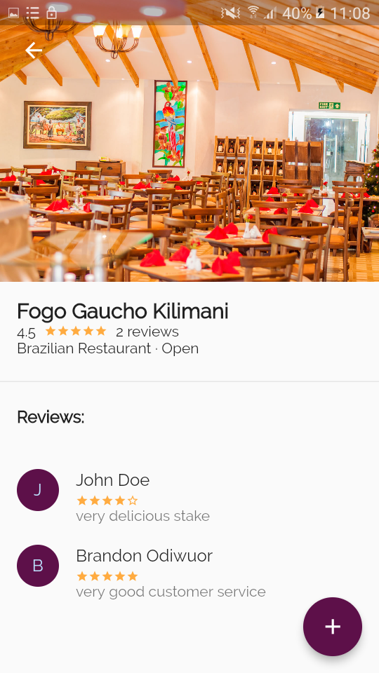

## Eat Out

A serveless flutter restaurant  review application bult using google cloud firestore and cloud functions as backed with view inspired by crane, material design case study.. 
The application allows users loged in using firebase authentication to check restaurants availabe, read reviews made on the restaurant by other users and also revoew the restaurants.

## Screenshots
     

-------------------------------------------------------------------------------------------------------

     

-------------------------------------------------------------------------------------------------------

